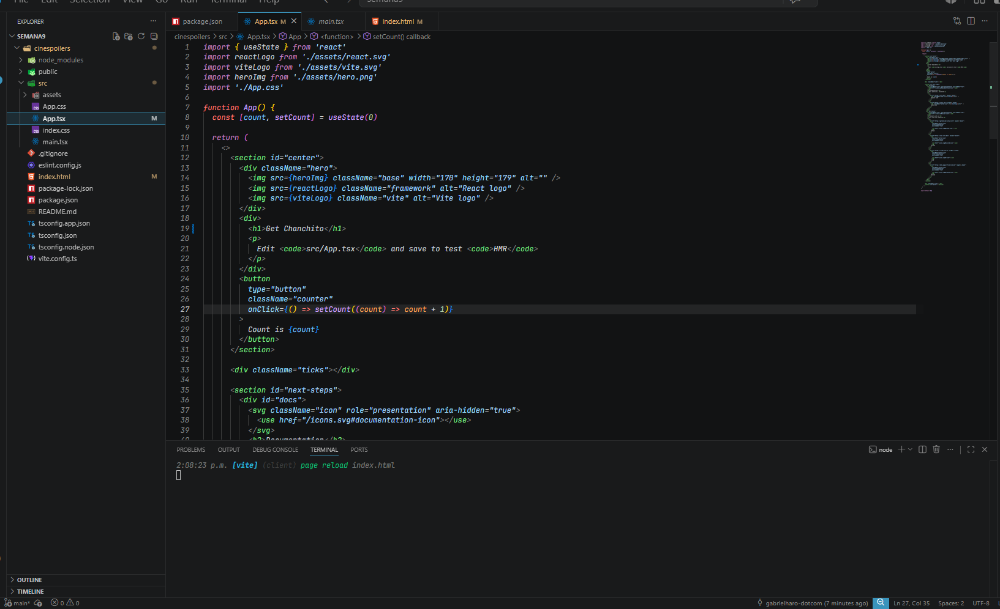
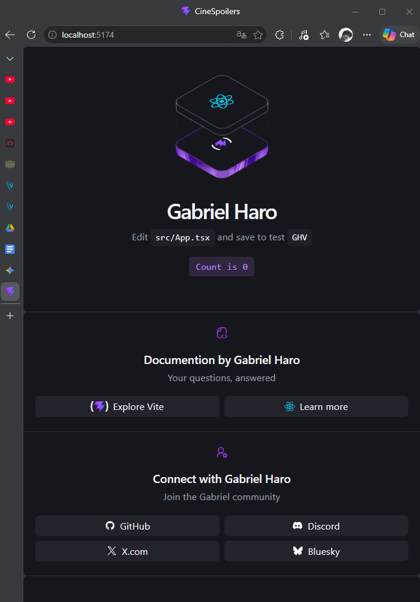
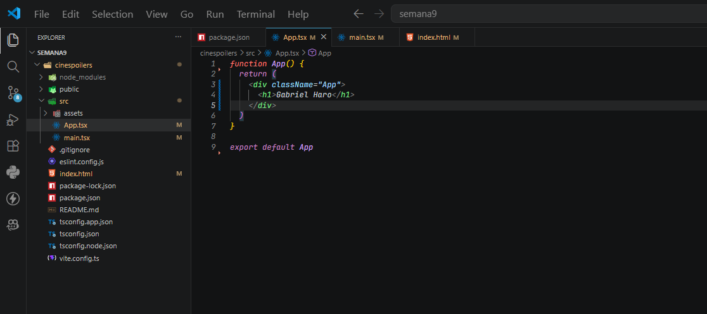
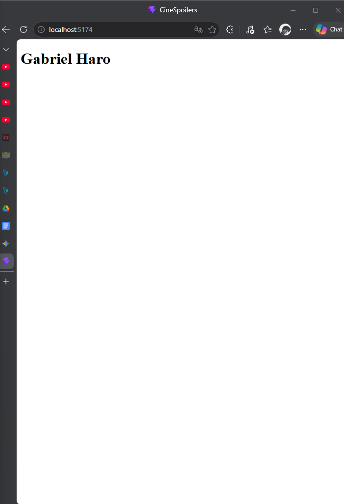
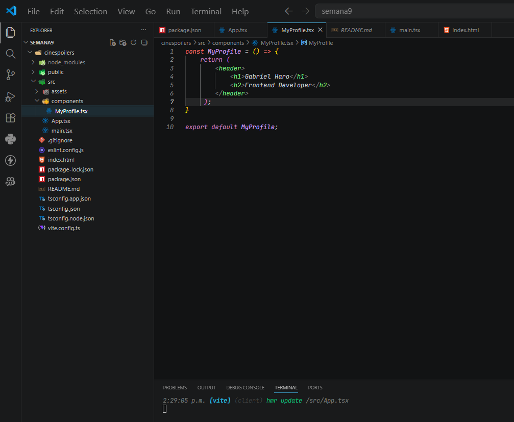
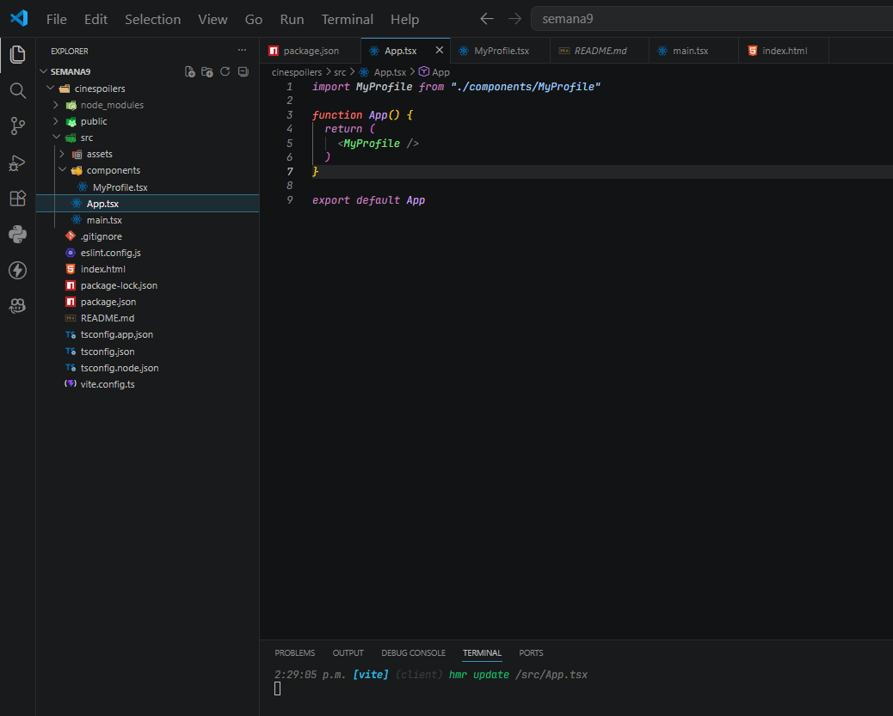
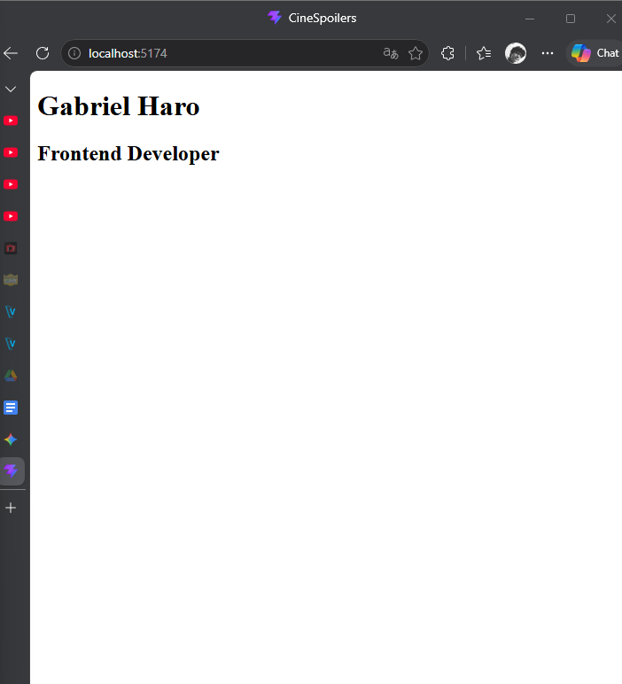

# Documentación del Laboratorio.

## Capturas de Gabriel Haro:
### Aplicación corriendo correctamente:

### Editar la página:

### Borrar los assest y css. Dejando solo la app.tsx con mi nombre:

### Crear un components (MyProfile) y conectandolo a App.tsx

## Capturas de Rony Quintana:

## Capturas de Oscar Olano: