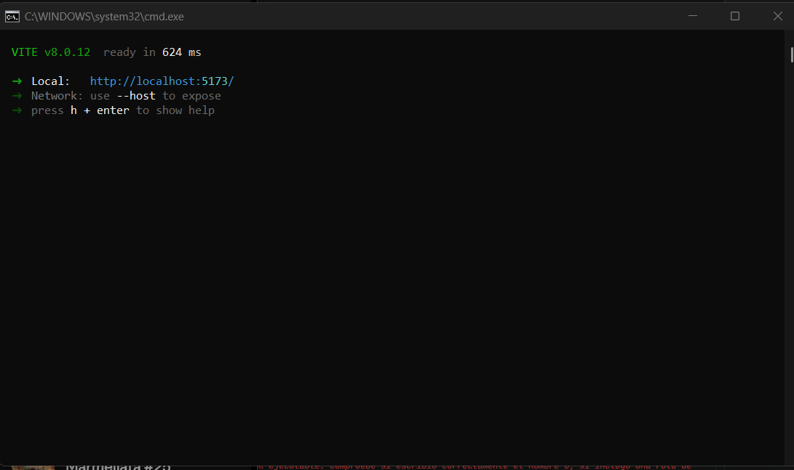
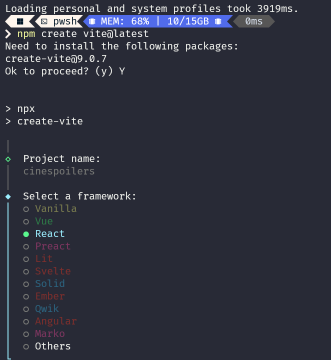

# Documentación del Laboratorio.

## Capturas de Gabriel Haro:
### Iniciando Proyecto:

### Aplicación corriendo correctamente:

### Editar la página:

### Borrar los assest y css. Dejando solo la app.tsx con mi nombre:

### Crear un components (MyProfile) y conectandolo a App.tsx

## Capturas de Rony Quintana:
## 🥇 Evidencia 1: Inicialización de React

## 🥈 Evidencia 2: Creación del Proyecto en Terminal

## 🥉 Evidencia 3: Estructura del Proyecto

## 🥈 Evidencia 4: Componente en React

## 🎖️ Evidencia 5: Renderizado en el Navegador

## Capturas de Oscar Olano:
## iniciando

## REACT

## CAMBIOS

## CAMBIOS 2
