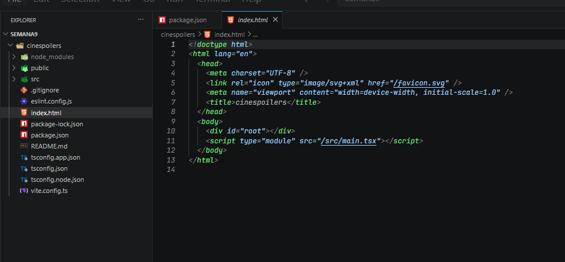
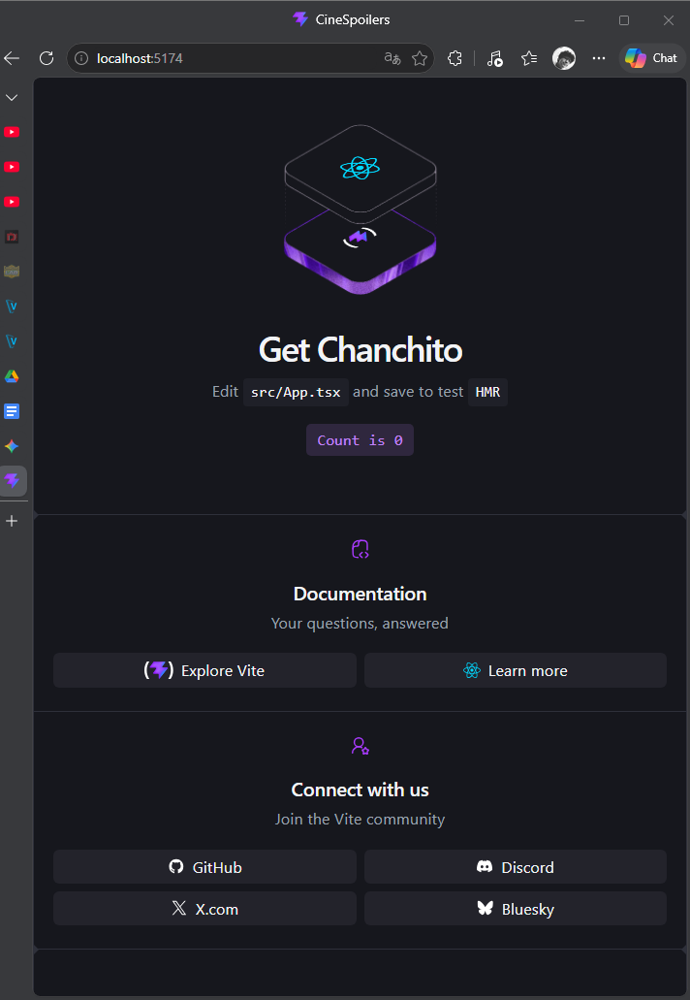
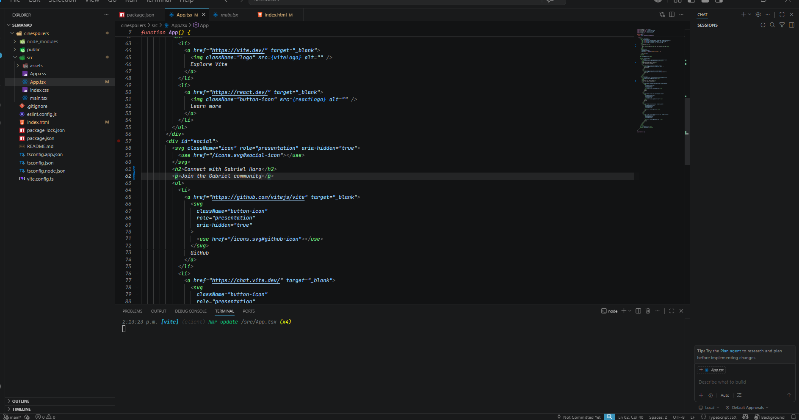

## Documentación del Laboratorio.
## Aplicación corriendo correctamente:

## Editar la página:

## Borrar los assest y css. Dejando solo la app.tsx con mi nombre:

## Crear un components (MyProfile) y conectandolo a App.tsx